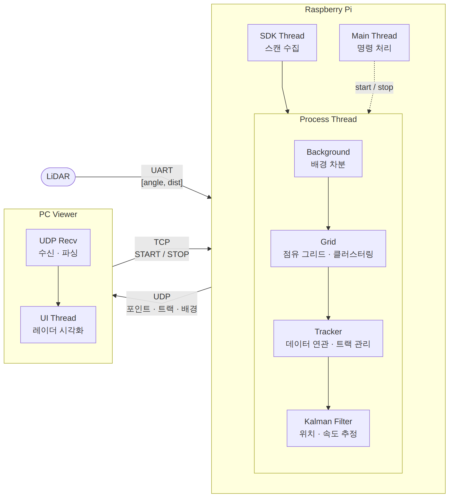
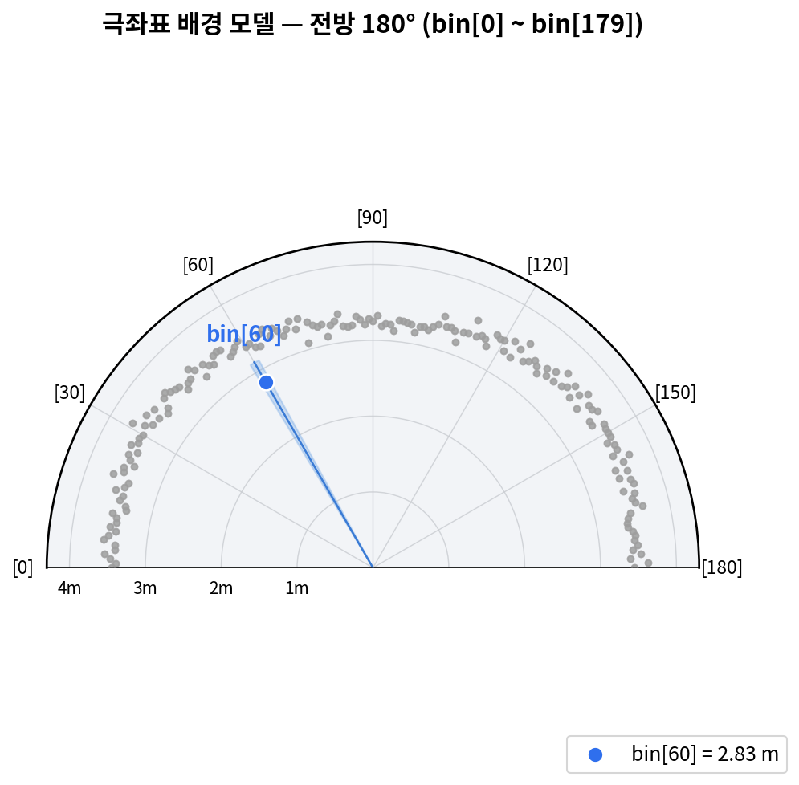
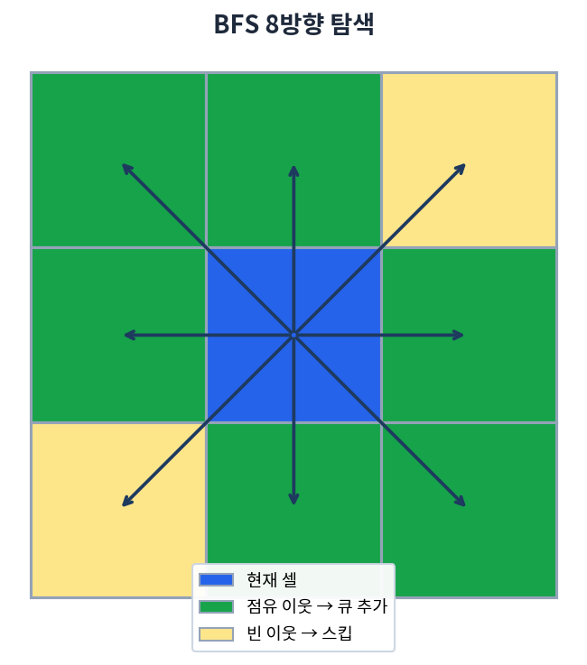

# LiDAR People Tracker

2D LiDAR로 실내 이동 객체를 실시간 검출·추적하는 시스템입니다.
Raspberry Pi에서 스캔 데이터를 처리해 객체의 위치와 속도를 추정하고, PC 뷰어로 전송해 레이더 형태로 시각화합니다.

**배경 차분 · 점유 그리드 클러스터링 · 칼만 필터 다중 객체 추적을 C++로 직접 구현**했습니다.

<p align="center">
  <video src="docs/lidar_demo.mp4" width="100%"></video>
</p>

---
## 네트워크

### 제어는 TCP, 데이터는 UDP


**제어 (TCP :2000) [PC -> Raspberry PI]**

START/STOP은 상태를 바꾸는 메시지입니다. 유실되면 PC UI와 RPi의 상태가 어긋나고, 사용자가 다시 명령해도 무시됩니다. 

**데이터 (UDP :3000) [Raspberry PI -> PC]**

데이터 전송은 최신 프레임이 중요하기 때문에 UDP를 사용해 유실 프레임을 건너뛰고 최신 데이터를 즉시 처리합니다.


---
<table>
<tr>
<td width="60%" valign="top">

## 시스템 구성



</td>
<td width="50%" valign="top">

## 처리 파이프라인

<big>
raw scan (극좌표)<br>

→ 배경 차분 (각도 bin별 통계 기반 전경 판정)<br>

→ 직교좌표 변환<br>

→ 점유 그리드 매핑 (160×160, 셀 10cm)<br>

→ BFS 8방향 클러스터링 → 객체 추출<br>

→ 칼만 필터 다중 객체 추적 (predict–associate–update)<br>

→ UDP 전송 → PC 시각화
</big>

</td>
</tr>
</table>

<br clear="all">

---

## 기술 스택

| 구분 | 내용 |
|---|---|
| 언어 | C++17 |
| 동시성 | POSIX Thread (pthread, mutex, condition variable) |
| 수치 연산 | Eigen3 |
| 센서 | YDLidar SDK (X4 Pro, 삼각측량 방식) |
| 통신 | BSD Socket (TCP / UDP), Tailscale VPN |
| PC UI | Dear ImGui + SDL2 + OpenGL 3.2 |
| 빌드 | Makefile |

---

## 핵심 구현

### 1. 배경 차분 (`Background/`)

벽·가구를 제거하고 이동 객체만 남기는 단계입니다. 직교좌표가 아닌 **극좌표(각도 bin) 공간에서 배경을 모델링**했습니다. LiDAR가 원래 각도–거리 쌍을 반환하므로 변환 없이 바로 비교할 수 있고, 각 방향의 노이즈 특성을 독립적으로 다룰 수 있기 때문입니다.

<div align="center">
  
</div>


- 180° → 180개 bin (1° 단위)
- 캘리브레이션 5초간 bin별 거리 샘플 수집
- bin별 **median**을 배경 거리로, **표준편차**를 노이즈 척도로 사용
- 전경 판정: `배경거리 - 측정거리 > k × σ`

임계값을 고정값이 아닌 `k × σ`로 둔 이유는, 벽이 비스듬한 방향일수록 같은 bin 안에서도 거리 편차가 크기 때문입니다. 방향마다 다른 판정 기준이 자동으로 적용됩니다.

샘플이 부족한 bin은 `valid_` 플래그로 검출 대상에서 제외합니다. (→ [트러블슈팅 1](#1-캘리브레이션-실패-bin이-전-방향-오검출을-유발))

### 2. 점유 그리드 & 클러스터링 (`Grid/`)

전경 점들을 공간적으로 묶어 객체 단위 centroid를 추출합니다.

- 1D flat vector 기반 점유 그리드 (`row * cols + col` 인덱싱)
  → 2D 벡터 대비 캐시 지역성 확보, 할당 1회
- 커버리지 ±8m, 셀 크기 10cm → 160×160
- **BFS 8방향 탐색**으로 연결 성분 추출
- 최소 셀 수 미만인 성분은 노이즈로 폐기


<div align="center">
  
</div>

셀 크기 10cm는 사람 몸통 폭(약 40~50cm)이 여러 셀에 걸치면서도, 노이즈 점 하나가 독립 클러스터가 되지 않는 값으로 선택했습니다.

### 3. 칼만 필터 (`Filter/`)

Eigen 기반으로 등속(constant velocity) 모델을 직접 구현했습니다.

- 상태 벡터: `[x, y, vx, vy]`
- 관측: 위치 `(x, y)`만 — 속도는 필터가 추정
- 프로세스 노이즈를 가속도 표준편차 기반으로 구성 (`Q = L·σ_a²·Lᵀ`)
- `dt`는 프레임 간 실측 시간(`CLOCK_MONOTONIC`)을 사용해 스캔 주기 흔들림에 대응

LiDAR는 위치만 측정하므로 속도는 관측 불가능합니다. 칼만 필터를 쓴 이유가 여기 있습니다 — 연속된 위치 관측으로부터 속도를 추정하고, 동시에 측정 노이즈를 평활화합니다.

### 4. 다중 객체 추적 (`Tracker/`)

매 프레임 `predict → associate → update` 순으로 동작합니다.

- **연관(association):** 모든 (track, centroid) 쌍의 거리를 계산 후 오름차순 정렬, 가까운 쌍부터 확정하는 전역 greedy 방식
- **track 생성:** 매칭되지 않은 centroid마다 생성하되, 연속 검출 횟수(`hits`)가 임계값을 넘어야 외부로 전송
- **track 삭제:** 연속 미검출(`missed_frames`)이 임계값 초과 시 제거

track별로 순차 greedy를 쓰면 앞 track이 잘못된 centroid를 선점하는 문제가 있어, 전체 쌍을 거리순으로 정렬한 뒤 확정하는 방식을 택했습니다.

### 5. 스레드 구조 (`threads/`)

| 스레드 | 역할 |
|---|---|
| SDK Thread | LiDAR SDK 폴링 → 스캔 버퍼 갱신 → 조건변수 signal |
| Process Thread | 조건변수 대기 → 파이프라인 처리 → UDP 송신 |
| Main Thread | TCP 제어 명령 수신 (START/STOP) |
| (PC) UDP Receiver | 수신 스레드 + mutex 보호 스냅샷 |

폴링 대신 조건변수를 사용해 데이터가 없을 때 CPU를 점유하지 않도록 했습니다.

### 6. 통신 프로토콜 (`Protocol.h`)

**제어는 TCP, 데이터는 UDP**로 분리했습니다.

- TCP: START/STOP 명령 — 유실되면 안 되므로 신뢰성 우선
- UDP: 스캔·트랙 데이터 — 재전송된 과거 프레임은 가치가 없으므로 지연 최소화 우선

메시지는 `MsgType`으로 구분되는 3종(POINTS / OBJECTS / BACKGROUND)입니다. 구조체는 고정 크기 배열을 갖지만 **실제 채운 개수만큼만 전송**합니다.

```cpp
size_t send_size = offsetof(PointFrame, points) + count * sizeof(Point2D);
```

수신 측은 동일한 식으로 페이로드 길이를 검증한 뒤 파싱해, 헤더가 주장하는 개수를 그대로 신뢰하지 않도록 했습니다.

---

## 트러블슈팅

### 1. 캘리브레이션 실패 bin이 전 방향 오검출을 유발

**증상**  UI에 정지된 벽 위치에 박스가 지속적으로 생성됨. 프로그램을 재시작할 때마다 발생 빈도가 크게 달라짐.

**원인**  캘리브레이션 중 유효 샘플을 얻지 못한 bin에 fallback 값(배경거리 20m)이 남아 있었습니다. 판정식이 `20 - 측정거리 > k × σ`가 되어 **어떤 거리가 들어와도 항상 전경**으로 분류됐습니다. LiDAR는 반사가 없으면 거리 0을 반환하는데, 유리창·저반사 표면·측정 한계 초과 방향이 여기 해당해 5초 내내 유효 샘플이 0개였습니다.

**해결**  bin별 `valid_` 플래그를 도입해 샘플 수가 기준 미만인 방향은 검출 대상에서 제외. fallback 값 자체를 방어 로직으로 삼는 대신, "모르는 방향은 판단하지 않는다"로 설계를 변경했습니다.

### 2. 샘플 부족 bin의 표준편차 처리

**증상**  1번 수정 후에도 벽 근처에 산발적으로 점이 검출됨.

**원인**  샘플이 1~2개인 bin은 표준편차를 계산할 수 없어 최소값으로 대체되는데, 이 값이 정상 bin과 동일한 판정 기준을 갖게 됩니다. 관측이 부실한 방향일수록 실제 편차는 클 가능성이 높은데도 가장 관대한 기준을 적용받는 모순이 있었습니다.

**해결**  최소 샘플 수 조건을 추가해 통계적으로 의미 있는 bin만 유효 처리.

### 3. 미확정 track 즉시 전송으로 인한 유령 박스

**증상**  일시적인 노이즈 클러스터가 즉시 박스로 표시되고, 객체가 사라진 뒤에도 속도 벡터가 계속 이동함.

**원인**  두 가지가 겹쳤습니다. ①track이 생성 즉시 전송되어 단발성 노이즈도 화면에 나타남. ②칼만 필터의 `predict`는 관측이 없어도 속도를 유지하므로, 미매칭 track이 마지막 속도로 계속 외삽됨.

**해결**  `hits` 카운터를 추가해 연속 검출된 track만 전송하고, 해당 프레임에 매칭되지 않은 track은 전송에서 제외. track 자체는 유지해 일시적 가림 후 재등장 시 ID 연속성을 보장합니다.

### 4. 이동 시맨틱스 — 소켓 fd 이중 해제

**원인**  `UDPSender`를 `std::move`로 전달할 때, fd가 단순 `int`이므로 기본 복사 시 두 객체가 동일한 fd를 소유하게 됩니다. 양쪽 소멸자가 모두 `close()`를 호출하면 두 번째 호출이 그 사이 재사용된 다른 fd를 닫을 수 있습니다.

**해결**  이동 생성자·이동 대입 연산자에서 원본 fd를 `-1`로 무효화하고, 소멸자는 유효 fd만 닫도록 구현. 복사 생성자·복사 대입 연산자는 `= delete`로 차단해 컴파일 시점에 오용을 막았습니다.

### 5. 조건변수 대기 중 스레드 종료 불가

**원인**  종료 플래그를 `false`로 설정해도, 워커 스레드가 `pthread_cond_wait`에서 대기 중이면 루프 조건을 재검사할 수 없습니다. 신호를 보내는 주체(LiDAR SDK)가 멈춘 상황에서는 `pthread_join`이 무한 대기합니다.

**해결**  종료 시 조건변수를 broadcast해 대기 중인 스레드를 명시적으로 깨우고, 대기 조건에 종료 플래그를 포함. 소켓 수신처럼 신호를 보낼 수 없는 경우에는 `SO_RCVTIMEO` 타임아웃으로 주기적 플래그 확인.

### 6. `rad_to_deg()` 부호 처리

**원인**  SDK가 반환하는 각도에 음수가 포함되는데, 이를 부호 없는 정수로 변환하면서 정의되지 않은 동작이 발생했습니다. ARM에서는 x86과 다른 결과가 나와 bin 인덱스가 잘못 계산됐습니다.

**해결**  float 반환을 유지하고 음수를 `+360`으로 정규화한 뒤 bin 인덱스를 계산.

> **TODO:** 아래 항목은 실측 후 채워넣기
> - 프레임당 처리 시간
> - 스캔당 평균 포인트 수
> - 유효 bin 비율

---

## 빌드 및 실행

### Raspberry Pi

**의존성**

```bash
sudo apt install build-essential cmake libeigen3-dev
# YDLidar SDK
git clone https://github.com/YDLIDAR/YDLidar-SDK.git
cd YDLidar-SDK && mkdir build && cd build
cmake .. && make && sudo make install
```

**빌드 및 실행**

```bash
cd rpi
make
sudo ./lidar_detection    # /dev/ttyUSB0 접근 권한 필요
```

### PC (Ubuntu)

**의존성**

```bash
sudo apt install build-essential libsdl2-dev libgl1-mesa-dev
# Dear ImGui는 third_party/ 에 포함
```

**빌드 및 실행**

```bash
cd pc
make
./lidar_viewer
```

### 실행 순서

1. RPi 프로그램 실행 → 배경 캘리브레이션 5초 (**이 동안 센서 주변에 이동 객체가 없어야 합니다**)
2. PC 뷰어 실행 → TCP 자동 연결
3. 뷰어에서 `START` 클릭

`main.cpp`의 `RPI_IP` / `PC_IP`를 각 환경에 맞게 설정해야 합니다. 원격 환경에서는 Tailscale VPN을 통해 연결했습니다.

---

## 주요 파라미터

| 상수 | 위치 | 의미 |
|---|---|---|
| `BG_NUM_BINS` | `rpi/main.cpp` | 배경 모델 각도 분할 수 |
| `BG_K` | `rpi/main.cpp` | 전경 판정 민감도 (σ 배수) |
| `BG_CALIB_MS` | `rpi/main.cpp` | 캘리브레이션 시간 |
| `GRID_MAX_RANGE` | `rpi/main.cpp` | 그리드 커버리지 (cm) |
| `GRID_CELL_SIZE` | `rpi/main.cpp` | 셀 한 변 길이 (cm) |
| `MIN_CLUSTER_CELLS` | `Grid.cpp` | 클러스터 최소 셀 수 |
| `ACCEL_STD` | `KalmanFilter.cpp` | 프로세스 노이즈 (가속도 σ) |
| `LIDAR_POS_STD` | `KalmanFilter.cpp` | 측정 노이즈 (위치 σ) |
| `match_threshold` | `Tracker.cpp` | 연관 최대 거리 (m) |
| `max_missed_frames` | `Tracker.cpp` | track 삭제 기준 |

---

## 디렉터리 구조

```
├── rpi/
│   ├── sensor/       # LiDAR SDK 래퍼, 스캔 버퍼
│   ├── Background/   # 배경 차분 모델
│   ├── Grid/         # 점유 그리드, BFS 클러스터링
│   ├── Filter/       # 칼만 필터
│   ├── Tracker/      # 다중 객체 추적
│   ├── threads/      # SDK / Process 스레드
│   ├── network/      # UDP 송신, TCP 수신
│   └── Protocol.h    # 공용 메시지 정의
└── pc/
    ├── network/      # UDP 수신, TCP 송신
    ├── SharedState   # 뮤텍스 보호 스냅샷
    └── main.cpp      # ImGui 레이더 뷰어
```

---

## 향후 개선

- **연관 알고리즘** — greedy 방식은 지역 최적해에 그칩니다. Hungarian 알고리즘으로 전역 최적 할당을 적용하면 객체가 교차할 때 ID 스위칭을 줄일 수 있습니다.
- **게이팅** — 현재는 고정 거리 임계값을 쓰지만, 칼만 필터의 공분산을 활용한 마할라노비스 거리 기반 게이팅이 이론적으로 타당합니다.
- **기동 모델** — 등속 모델은 사람이 급격히 방향을 바꿀 때 오차가 커집니다. IMM(Interacting Multiple Model)으로 등속/등가속 모델을 전환하는 방식을 검토 중입니다.
- **병렬화** — 클러스터링과 좌표 변환은 데이터 병렬성이 있어 OpenMP 적용이 가능합니다.
- **센서 융합** — 초음파 센서를 추가해 LiDAR가 취약한 저반사 표면을 보완.